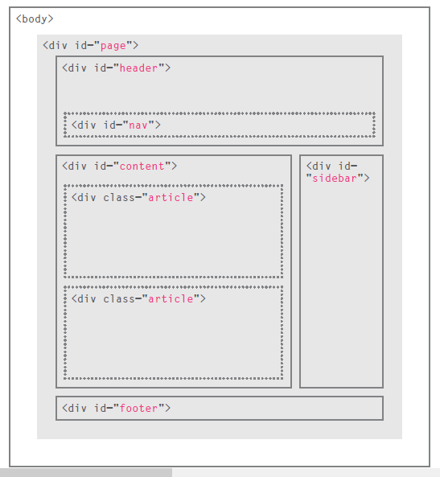
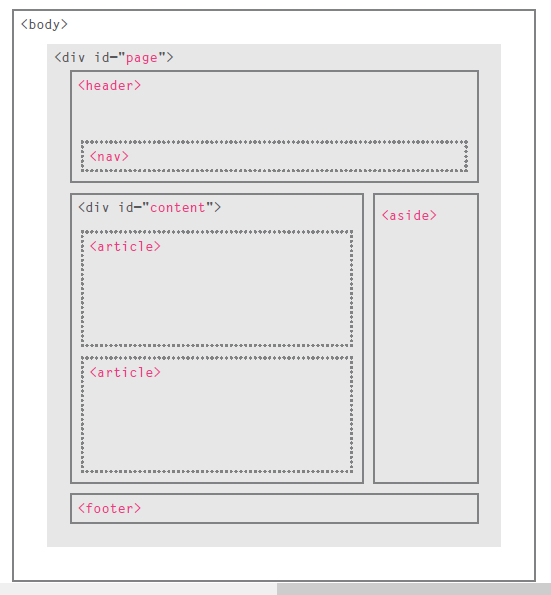
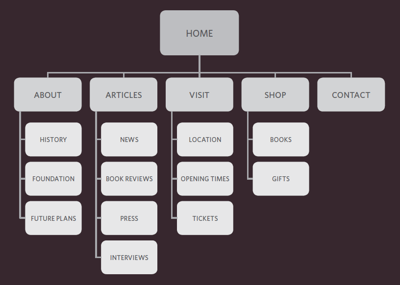
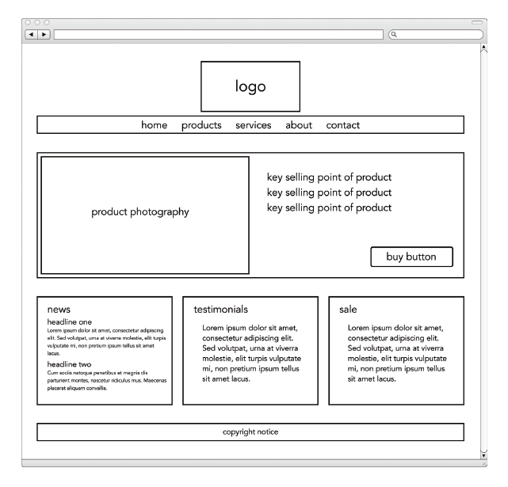
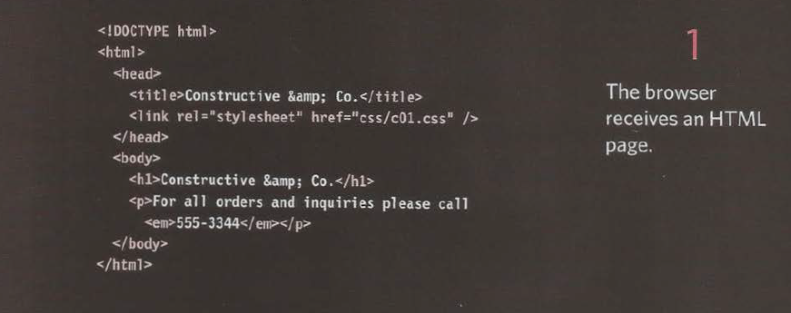
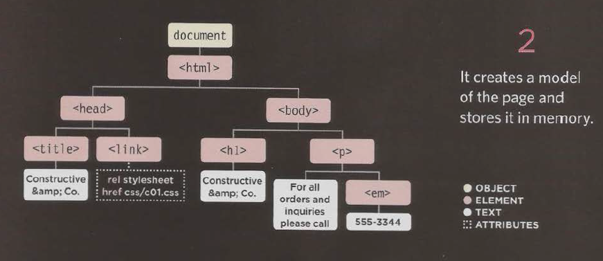

[Home](README.md)

<br>

# Introductory Readings from Jon Duckett's books

<br>

## Readings from `HTML & CSS: Design and Build Websites`

<br>

### HTML Chapter 1: Structure

<br>

#### Usage of HTML

- `HTML` is used to define the `skeletal` structure of a webpage in text-format, it is used to mark how will content be composed when rendered.

- Tags work as content containers, ideally they are used in this format

```
<b> CONTENT GOES HERE </b>

where <b> is an opening tag
      </b> is a closing tag
      and what goes in-between is called content
      the whole block is called an HTML element
```

<br>

- Some `HTML` tags are essential for the document to function and form its' primary structure

```
<!DOCTYPE html>

 <html>

  <head>

  </head>

  <body>

  </body>

 </html>

```

<br>

- Tags can contain more information within them to perform more distinct functions

```


img       is the tag name
src       is an attribute
image.jpg is the attribute's value
```

<br>

### HTML Chapter 8: Extra Markup

<br>

#### Usage of Tags

- Not all tags render visible content for the user, some of them are used to store, identify, format, and organize information regarding the webpage or content.

 `<!DOCTYPE html>, <div>, <section>, <meta>, <span>, ...`

- You can use tags to comment text (it won't appear in the rendered page in any form) using comment tags:

 `<!-- COMMENT GOES HERE -->`

<br>

#### Special Characters

- Some code is reserved for referencing special characters (symbols) in `HTML`, these are called `Escape Characters`.

- You can type the code to make the call the symbols in the rendered page.

<br>

Symbol                    | Code
--------------------------|--------------------------
`<`                       | `&lt;`   or  `&#60;`
`>`                       | `&gt;`   or  `&amp;`
`&`                       | `&amp;`  or  `&#38;`
`"`                       | `&quot;` or  `&#34;`
`©`                       | `&copy;` or  `&#169;`
`®`                       | `&reg;;` or  `&#174;`

<br>

### HTML Chapter 17: HTML5 Layout

<br>

#### Traditional HTML Layout

> For a long time, web page authors used <div> elements to group
together related elements on the page (such as the elements that form a
header, an article, footer or sidebar). Authors used class or id attributes
to indicate the role of the <div> element in the structure of the page.

<br>



<br>

#### New HTML5 Layout Elements

> HTML5 introduces a new set of elements that allow you to divide up the
parts of a page. The names of these elements indicate the kind of content
you will find in them. They are still subject to change, but that has not
stopped many web page authors using them already.

<br>



<br>

- `<header>`, `<footer>`, `<nav>`, and `<article>` are examples of HTML5 Layout Elements. They indicate the purpose of whatever goes within them and refute the constant use of `<div>` tag with identifiers to structure pages.

<br>

### HTML Chapter 18: Process & Design

<br>

#### User Base

- Each site has a predicted/targeted user base whom may vary in age, gender, interests or even technical capabilities.

- The site should be optimized to fit all groups who'll be using it, whether it be on visual clarity or ease of navigation and the way information is displayed and delivered. 

<br>

#### Site Map

- Each site should have a tree-type diagram that organizes different areas of the site and shows how can users navigate into and access them.

<br>



<br>

#### Wireframe

- Wireframe diagrams/sketches are used to scheme the visual structure of webpages.

- They provide a result guideline to work towards when coding webpages.

- Webpages Design should be pragmatic, comfortable, clear, functional for different users and responsive to their inputs and interactions.

<br>



<br>

<br>

## Readings from `Javascript and JQuery: Interactive Front-End Web Development`

<br>

### JS Chapter 1: The ABC of Programming

<br>

#### What is a script?

> A script is a series of instructions that a
computer can follow to achieve a goal.

- Scripts are used to perform specific functions in a specific order when called, they may be used fully or partially, depending on the circumstances.

- Scripts are used to automate tedious tasks and save the code writer from having to repeat code many times in different places.

<br>

#### Creating a Script

- In order to create a proper script, you need to lay down every step that the computer will have to go through in your code to get the desired results:

1. Define the goal, meaning the end result of your script, what do you want it to achieve.

2. Design the Script, laydown the tasks that you need the computer to perform, in flowcharts or steps, depending on the type and complexity of the action.

3. Code it, convert your pseudo code steps into proper code in a programming language so the computer could follow it. And keep the user experience in your mind, how will the outcomes display or be delivered, and advance accordingly.

<br>

#### Computers and the real world

- Computers have no consciousness, they do as they are tasked and "know" the information they are fed by human users.
- Information need to be broken down to the most primary form for computers to be able to "compute" it.
- Physical objects are referred to as `Objects` in computer terms.
  - `Objects` can exist in a specific number of `Instances`
  - Each `Object` can have its' own `Properties`, `Events`, and `Methods` to be represented properly.

  <br>

- `Properties` are equivalent to Characteristics, each `Property` has a `name` and a `value` to it.

<br>

```
color: Red
```

<br>

- `Events` are the way `Objects` interact with other entities.
- `Objects` can respond to specific `Events`, activating a specific part of code.

<br>

- `Methods` are how other entities interact and respond to `Objects`.
- You need to understand how will the `Object` receive your request and how will you receive its' output.

<br>

- All of these used together allow computers to interpret how things will behave and react to specific thing and their results.
- This same concept applies to how computers interpret `HTML document` as an `Object` and how they are rendered on user interface.
  - `Properties` outline the webpage Characteristics.
  - `Events` govern when specific parts of the code are triggered.
  - `Methods` will achieve assigned tasks when needed.

  <br>

  ```
  OBJECT TYPE       DOCUMENT

  PROPERTIES

  URL  :  http//www.**********.com/
  title:  webpage title

  EVENTS 

  load    :    page and assets have finished loading
  click   :    user clicks the mouse over the page
  keypress:    user presses down on a key

  METHODS

  write()          :  adds new content to the document
  getelementbyid() :  accesses an element when you state its id attribute

  ```

  <br>

#### How Browsers see Webpages

>  RECEIVE A PAGE AS HTML CODE.



>  CREATE A MODEL OF THE PAGE AND STORE IT IN MEMORY



>  USE A RENDERING ENGINE TO SHOW THE PAGE ON SCREEN


<br>

> All major browsers use a JavaScript interpreter to translate your instructions (in JavaScript) into instructions the computer can follow.

<br>

#### Using HTML, CSS, and Javascript together

<br>

Language           | Purpose
-------------------|-----------------------------------------------------  
`HTML`             | `Content of Webpages`, `Page Structure`, `Semantics`
`CSS`              | `Presentation`, `Style`
`JavaScript`       | `Interactivity`, `Adjustments`, `Responsiveness`

<br>

#### Javascript code line structure

- Calling the method of an object is done using this line of code as an example:

```
document.write("TEXT GOES HERE")

Where: 
      document         is an object (the whole webpage)
      .                is a member operator used to access Methods andProperties
      write()          is a method of the document
      "TEXT GOES HERE" is a parameter that is extra information required by the method

```

