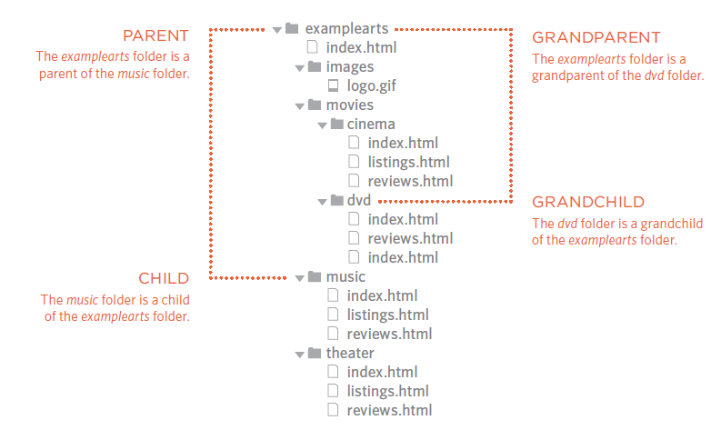
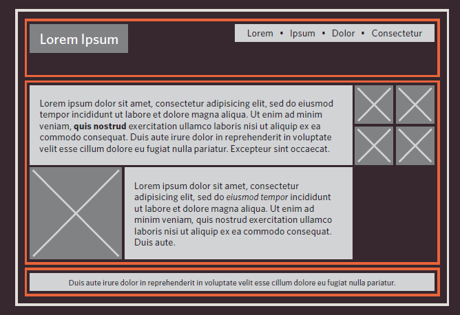

[Home](README.md)

<br>

# HTML Links, JS Functions, and Intro to CSS Layout - from Jon Duckett's books

<br>

## Readings from `HTML & CSS: Design and Build Websites`

### HTML Chapter 4: Link

<br>

#### Links in HTML

- `Anchor` tags `<a>` are used to mark links in `HTML`.
- `href` attribute is used to specify the location/URL of the linked element.

```
<a href="URL HERE FOR EXTERNAL SITES"> LINK TEXT </a>

<a href="FILE NAME AND PATH HERE FOR INTERNAL LINKS"> LINK TEXT </a>

```
<br>

#### Directory Structure

> On larger websites it's a good idea to organize your code by placing the pages for each different section of the site into a new folder. Folders on a website are sometimes referred to as directories.



#### Relative URLs 

> Relative URLs can be used when linking to pages within your own website.


Relative Link Type           | Example
-----------------------------|---------------------------------
Same Folder                  | To link to music reviews from the music homepage: <a href="reviews.html">Reviews</a>
Child Folder                 | To link to music listings from the homepage: <a href="music/listings.html">Listings</a>
Grandchild Folder            | To link to DVD reviews from the homepage: <a href="movies/dvd/reviews.html"> Reviews</a>
Parent Folder                | To link to the homepage from the music reviews: <a href="../index.html">Home</a>
Grandparent Folder           | To link to the homepage from the DVD reviews: <a href="../../index.html">Home</a>

<br>

#### e-mail links

- Use these to launch the users mailing app and specify the reciever as the assigned e-mail adress.

`<a href="mailto:email@adress.com"> SEND MAIL </a>`
 
<br>

#### Opening Links in New Window

- Use `target=_blank` attribute and value to achieve this:

`<a href="URL" target="_blank" `

<br>

#### Linking to the Same Page

`<a href="#SPECIFIC_HTML_ELEMENT_ID"> LINK TEXT </a>`

- You can use a similar method to link a specific part of another page.

`<a href="URL/#ID"> LINK TEXT </a>`


<br>

### CSS Chapter 15: Layout

<br>

#### Positioning Elements

> CSS treats each HTML element as if it is in its own box. This box will either be a block-level box or an inline box.

- Element Types 
  - Block Level Elements *(Start on new line)*
  `<h1>, <p>, <ul>, <li>, ...`
  - Inline Element *(Flow inbetween surrounding text)*
  `, <b>, <i>, ...`
 
> If one block-level element sits inside another block-level element then the outer box is known as the containing or parent element.



> The orange lines in this diagram represent <div> elements. The header (containing the logo and navigation) are in one <div> element, the main content of the page is in another, and the footer is in a third. The <body> element is the containing element for these three <div> elements. The second <div> element is the containing element for two paragraphs of Latin text and images (represented by crossed squares).

<br>

- CSS has five schemes for positioning elements:
1. Normal flow 
`Every block-level element appears on a new line, causing each item to appear lower down the page than the previous one.`
2. Relative Positioning
`This moves an element from the position it would be in normal flow, shifting it to the top, right, bottom, or left of where it would have been placed.`
3. Absolute Positioning
`This positions the element in relation to its containing element.`
4. Fixed Positioning
`This is a form of absolute positioning that positions the element in relation to the browser window, as opposed to the containing element. Elements with fixed positioning`
5. Floating Elements
`Floating an element allows you to take that element out of normal flow and position it to the far left or right of a containing box.`

- Use `z-index` property to control overlapping elements order.
- Use `clear` property to clear floats.

<br>


## Readings from `Javascript and JQuery: Interactive Front-End Web Development`

<br>

### JS Chapter Chapter 3 (first part): Functions, Methods, and Objects

<br>

#### JS Funtions

> Functions let you group a series of statements together to perform a specific task. If different parts of a script repeat the same task, you can reuse the function.

<br>

#### Delcaring Functions

- Before you use (call) a function, you need to declare it.
- Some functions require further information to work, which can be specified using parameters.
- Parameters can be either variables or values.
- You can declare and call a function in this format:

```
function function_name(parameters){
    code to be executed when called upon;
}

function_name(parameters);

as an example:

function sumXY(x + y){
    return x + y;
}

sumXY(number 1 + number 2);
```
- Functions can be also declared in expressions, being assigned to a variable.
- Functions stored in variables are called anonymous functions.

```
let function_name = function(parameters){
        code to be executed when called upon;
}

function_name(parameters);
```

<br>

#### Immediately Invoked Function Expressions (IIFE)

> Often functions are used to ensure that the variable names do not conflict with each other (especially if the page uses more than one script).

```
let function_name = (function(){
        code to be executed;
} () ) ;

```

<br>

- Use Anonymous Functions and IIFE when:
  - As an argument when a function is called (to calculate a value for that function).
  - To assign the value of a property to an object.
  - In event handlers and listeners to perform a task when an event occurs.
  - To prevent conflicts between two scripts that might use the same variable names.

  <br>

  #### Variables Scope

  > The location where you declare a variable will affect where it can be used within your code. If you declare it within a function, it can only be used within that function. This is known as the variable's scope.

  - Local Variables: 

  > When a variable is created inside a function using the var keyword, it can only be used in that function. It cannot be accessed outside of the function in which it was declared.

  - Global Variables:

  > If you create a variable outside of a function, then it can be used anywhere within the script. It is called a global variable and has global scope.

  > Global variables use more memory. The browser has to remember them for as long as the web page using them is loaded. Local variables are only remembered during the period of time that a function is being executed.

  <br>

  ## Readings from [6 Reasons for Pair Programming](https://www.codefellows.org/blog/6-reasons-for-pair-programming/)

  <br>

  ### Pair Programming?

  - The article claims that programming in pairs is a good prctice stating the following arguments:

<br>

  #### How does pair programming work?

> Pair programming commonly involves two roles: the Driver and the Navigator.

- The Driver's responsibilities:
  - Handling the “mechanics” of coding.
  - Managing the text editor.
  - Switching files.
  - Version control.
  - Writing Code.

- The Navigator:
  - Thinks about the big picture, what comes next.
  - How an algorithm might be converted in to code.
  - Scanning for typos or bugs. 
  - Utilize their computer as a second screen to look up solutions and documentation.
  

  <br>

  #### Why pair program?

> Pair programming touches on all four skills: developers explain out loud what the code should do, listen to others’ guidance, read code that others have written, and write code themselves.

<br>

#### What does pair programming Offer?
 
1. Greater efficiency
2. Engaged collaboration
3. Learning from fellow students
4. Social skills
5. Job interview readiness
6. Work environment readiness


