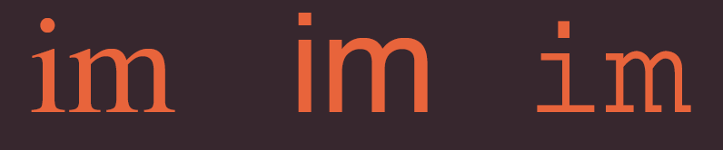

[Home](README.md)

 

# HTML Images; CSS Color & Text - from Jon Duckett's books

 

## Readings from `HTML & CSS: Design and Build Websites`

### HTML Chapter 5: Images

 

#### Why Use Images in Websites?

> Images can be used to set the tone for a site in less time than it takes to read a description.

- When using images make sure that Images should be:
  - Be relevant
  - Convey information
  - Convey the right mood
  - Be instantly recognisable
  - Fit the color palette

 

#### Storing Images on Site

> If you are building a site from scratch, it is good practice to create a folder for all of the images the site uses.

 

#### Adding Images

- Use `` tag to add images in `HTML`.
``

- Attributes like `alt` and `title` can be used to add description and title to images in order.
- Specify Images Height and Width using `height` and `width` attributes.
- Common Image extensions are `.jpeg, .png, and .gif`.

 

#### Figue and Figue Caption

- Use `<figure>` tag to add caption to one or more images.
- Use `<figurecaption>` inside `<figure>` tag to add caption to images.

 

### CSS Chapter 11: Color

 

#### Colors in CSS

- Use `color` property to specify foreground color (text color).
- Use `background-color` to specify color of the container element.

 

#### Understanding Color

> Every color on a computer screen is created by mixing amounts of red, green, and blue.

- RGB Values
  - Values for red, green, and blue are expressed as numbers between 0 and 255. `rgb(x, x ,x)`
- RGBA
 - Same as RGB system but with additional `Alpha Channel` (Opacity) parameter. `rgba(x, x, x, y)`
- Hex Codes
  - Hex values represent values for red, green, and blue in hexadecimal code. `#xxxxxx#`
- Color Names
  - Colors are represented by predefined names. However, they are very limited in number. `colorname`
- HSL/HSLA Colors
  - A way to specify colors using hue, saturation, and lightness values and `Alpha Channel` in `HSLA` case. `HSL (x, y ,z/ , a)`

   

- Hue 
  - Hue is near to the colloquial idea of color. Technically speaking however, a color can also have saturation and brightness as well as hue.
- Saturation
  - Saturation refers to the amount of gray in a color. At maximum saturation, there would be no gray in the color. At minimum saturation, the color would be mostly gray.
- Brightness
  - Brightness (or "value") refers
to how much black is in a color. At maximum brightness, there would be no black in the color. At minimum brightness, the color would be very dark.
- Contrast
  - When picking foreground and background colors, it is important to ensure that there is enough contrast for the text to be legible.

 

### CSS Chapter 12: Text

 

#### Typeface Terminology

- Serif
  - Serif fonts have extra details on the ends of the main strokes of the letters. These details are known as serifs.
- Sans-Serif
  - Sans-serif fonts have straight ends to letters, and therefore have a much cleaner design.
- Monospace
  - Every letter in a monospace (or fixed-width) font is the same width. (Non-monospace fonts have different widths.)

 

#### Specifying Typefaces

- Use `font-family` property to specify the typeface that will be used for any text inside the element.

- Refer to `@font-face` to use a font, even if it is not installed on the computer of the person browsing.

> When choosing a typeface, it is important to understand that a browser will usually only display it if it's installed on that user's computer.

- Use `font-size` property to specify text size in `px, %, em, ..`

- Units of Type Size

- Use `text-transform` to transform font into Uppercase/Lowercase/Capetalized.

- Use `text-decoration` to specify text decoration from `none, underline, overline, line-through, blink`.

- Use `line-height` to control text Leading (the vertical space between lines of text).

- Use `letter-spacing, word-spacing` to control Kerning (the space between each letter).

- Use `text-align` to control the alignment of text `left, right, center, justify`.

- Use `vertical-align` is not intended to allow you to vertically align text in the middle of block level elements. It is more commonly used with inline elements such as `, <em>, or <strong>` elements.

- Use `text-indent` to indent the first line of text within an element.

- Use `text-shadow` to create a drop shadow, which is a dark version of the word just behind it and slightly offset.

- Use `:link, :visited` to set styles for links that have not yet been visited, and to set styles for links that have been clicked on respectively.

- Use `:hover, :active, :focus` to control element style when it's being hovered on/ activated or the element is in focus ( can be interacted with).

 

#### Attributes Selectors

Selector                                | Usage 
----------------------------------------|----------------------------------------
Existence                               | [] Matches a specific attribute (whatever its value) `p[class]`
Equality                                | [=] Matches a specific attribute with a specific value `p[class="dog"]`
Space                                   | [~=] Matches a specific attribute whose value appears in a spaceseparated `p[class~="dog"]`
Prefix                                  | [^=] Matches a specific attribute whose value begins with a specific string `p[attr^"d"]`
Substring                               | [*=] Matches a specific attribute whose value contains a specific substring `p[attr*"do"]`
Suffix                                  | [$=] Matches a specific attribute whose value ends with a specific string `p[attr$"g"]`

 

## Readings from [JPEG vs PNG vs GIF](https://blog.imagekit.io/jpeg-vs-png-vs-gif-which-image-format-to-use-and-when-c8913ae3e01d)

 

#### Which image format to use and when?

 

- JPEG
  - Use for all images that contain a natural scene or photograph where variation in colour and intensity is smooth.
  - Is a lossy compression specification that takes advantage of human perception.
  - JPEG compression works by averaging out colours of nearby pixels.
  - If an image contains text or lines, where a sharp contrast between adjacent pixels is desired to highlight the proper shape, this lossy compression technique does not yield good results.
  - JPEG images don’t support transparency and are hence not usable for such cases.
  - JPEG images can support around 16 million colours.

 

- PNG
  - Use PNG format for any image that needs transparency or for images with text & objects with sharp contrast edges like logos.
  - PNG is a lossless image format. No data is lost during compression and no compression artefacts are introduced in the image. 
  - PNG image would retain higher quality than an image than JPEG and would look a lot sharper, it would also occupy more space on the disk.
  - Unsuitable for storing or transferring high-resolution digital photographs but a great choice for images with text, logos and shapes with sharp edges.
  - PNG images support transparency in two ways — inserting an alpha channel that allows partial transparency or by declaring a single colour as transparent.
  - PNG images mainly have two modes — PNG8 and PNG24. PNG8 can support upto 256 colours whereas PNG24 can handle upto 16 million colours like a JPEG image.

 

- GIF
  - Use for images that contain animations.
  - GIF is also a lossless image format. It was favoured over PNG for simple graphics in websites in its early days.
  - GIF images support transparency by declaring a single colour in the colour palette as transparent.
  - GIF images are limited to 256 colours.
  - Of these 3 formats, only GIF supports animation.