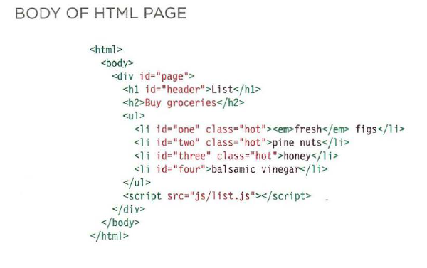
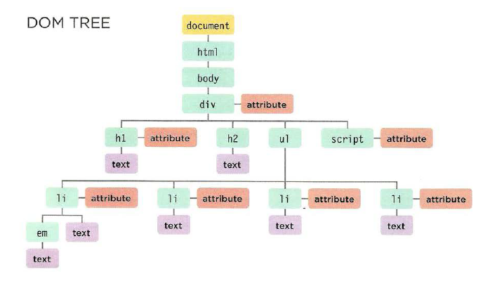

[Home](README.md)

<br>

# HTML Images; CSS Color & Text - from Jon Duckett's books

<br>

## Readings from [Understanding The Problem Domain Is The Hardest Part Of Programming](https://simpleprogrammer.com/understanding-the-problem-domain-is-the-hardest-part-of-programming)

<br>

#### Why problem domains are hard?

- The author explains why he thinks problem domains are the hardest part of programming in his opinion
- He claims that creating a familiar problem domain, something like an analogy, you take away the hard part out of it.
- He uses puzzles with no recognizable images as an example:
  - Figure out what the major components of the picture are.
  - Sort the pieces by color or component.
  - Put together all the border pieces.
  - Put together each component of the picture from the piles you created.

> This all breaks down when you don’t have a picture with clear components that you can identify.

> The same thing happens when writing code.  Writing code is a lot like putting together a jigsaw puzzle.  We put together code with the purpose of building components that we have taken out of the “bigger picture” of the problem domain.

> The big issue is that many problem domains are like a puzzle with a blurry picture or no picture at all.

<br>

#### Programming is easy if you understand the problem domain

- He argues that knowing the extent of the domain makes it easy to solve, as you know what you're working towards.

> It is very difficult to solve a problem before you know the question.  It’s like buzzing in on Jeopardy before you hear the clue and shouting out random questions.

<br>

#### What can you do about it?

- The author advises you to do one of the following:
  - Make the problem domain easier.
  - Get better at understanding the problem domain.

> You can often make the problem domain easier by cutting out cases and narrowing your focus to a particular part of the problem.

> It is easy to fall into the trap of thinking you understand enough of the problem to get started coding it

<br>

## Readings from `Javascript and JQuery: Interactive Front-End Web Development`

### JS Chapter 3: Object Literals

<br>

#### What is an Object?

- `Object`s group together a set of variables and functions to create a model of a something you would recognize from the real world.
  - If a variable is part of an `Object`, it is called a `Property`. `Properties` tell us about the `Object`.
  - If a function is part of an `Object`, it is called a method. `Methods` represent tasks that are associated with the `Object`.
  - Like variables and named functions, `Properties` and `Methods` have a name and a value called a `Key`.
  - An `Object` cannot have two keys with the same name.
  - The value of a `Property` can be a string, number, Boolean, array, or even another `Object`.
  - The value of a method is always a function.

  <br>

  #### Creating an Object?

- One way to create an `Object` is `Litteral Notation`.

```
var object{
    // properties: 
    name: 'key',
    number: key,
    check: key,

    // methods:
    methodname function(){
        code
   }
};
```

<br>

#### Accessing Objects

- Use `Dot Notation` to acces `Properties` or `Methods` inside `Objects`.

```
var variable1 = object.property;

var variable2 = object.method();
```

<br>

### JS Chapter 5: Document Object Model

<br>

#### DOM Tree

- The DOM Tree is a model of a Webpage created while the browser loads it.



- The Document Node
  - Every element, attribute, and piece of text in the HTML is represented by its own DOM node.
  - At the top of the tree a document node is added; it represents the entire page.
  - When you access any element, attribute, or text node, you navigate to it via the document node. It is the starting point for all visits to the DOM tree.

<br>

- Element Nodes
  - HTML elements describe the structure of an HTML page.
  - To access the DOM tree, you start by looking for elements. Once you find the element you want, then you can access its text and attribute nodes if you want to.
  - Every node is a descendant of the document node.

<br>

- Relationships between the document and all of the element nodes are described using the same terms as a family tree: parents, children, siblings, ancestors, and descendants.
- Each node is an object with methods and properties.
- Scripts access and update this DOM tree (not the source HTML file).
- Any changes made to the DOM tree are reflected in the browser.

<br>



- Attribute Nodes
  - The opening tags of HTML elements can carry attributes and these are represented by attribute nodes in the DOM tree.
- Attribute nodes are not children of the element thar carries them; they are part of that element.
- Once you access an element, there are specific JavaScript methods and properties to read or change that element's attributes.

<br>

- Text Nodes
  - Once you have accessed an element node, you can then reach the text within that element. This is stored in its own text node.
  - Text nodes cannot have children. If an element contains text and another child element, the child element is not a child of the text node but rather a child of the containing element.

